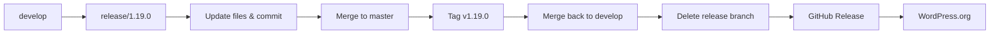
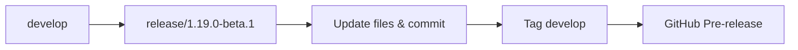
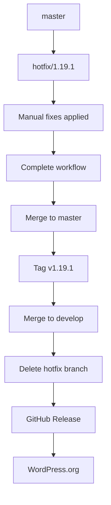

# 🚀 Popup Maker Release Workflow System

Complete documentation for the GitHub Actions release workflow system with git-flow, automated builds, and team notifications.

## 📋 Table of Contents

- [Overview](#overview)
- [Prerequisites](#prerequisites)
- [Workflow Types](#workflow-types)
- [Environment Protection](#environment-protection)
- [Usage Guide](#usage-guide)
- [Git Flow Process](#git-flow-process)
- [Slack Notifications](#slack-notifications)
- [Troubleshooting](#troubleshooting)
- [Best Practices](#best-practices)

## Overview

The release system consists of three separate workflows designed for different purposes:

### 🔨 **Build Workflow** (`build.yml`)
- **Purpose**: Generate test builds from any branch
- **Access**: Anyone with repository access
- **Output**: Test ZIP packages for QA and development
- **No Repository Changes**: Never commits or tags

### 🚀 **Release Workflow** (`release.yml`) 
- **Purpose**: Create official releases using git-flow methodology
- **Access**: Protected (requires approval)
- **Process**: develop → release branch → master → tag → GitHub release → WordPress.org
- **Repository Changes**: Full git-flow with commits and tags

### 🛠️ **Hotfix Workflow** (`hotfix.yml`)
- **Purpose**: Emergency patches with dual-mode operation
- **Access**: Protected (requires approval)
- **Modes**: Create hotfix branch OR complete existing hotfix
- **Process**: master → hotfix branch → master → tag → releases

## Prerequisites

### Required GitHub Secrets

Configure these secrets in your repository settings:

```yaml
# WordPress.org Deployment
SVN_USERNAME: your-wordpress-org-username
SVN_PASSWORD: your-wordpress-org-password

# Slack Notifications
SLACK_WEBHOOK_SUCCESS: https://hooks.slack.com/services/... # Team announcements
SLACK_WEBHOOK_FAILURE: https://hooks.slack.com/services/... # Dev/alerts channel  
SLACK_WEBHOOK_DEV: https://hooks.slack.com/services/...     # Development updates
```

### Repository Setup

1. **Branches**: Ensure `master` and `develop` branches exist
2. **Changelog**: Maintain `CHANGELOG.md` with "Unreleased" section
3. **Build Script**: Have `bin/update-changelog.js` for changelog processing
4. **Release Script**: Have `bin/build-release.js` for package creation
5. **Environment Protection**: Configure `production` environment with approvers

## Workflow Types

## 🔨 Build Workflow

**File**: `.github/workflows/build.yml`

### Purpose
Generate test builds from any branch without making repository changes.

### Options

| Option | Description | Default | Required |
|--------|-------------|---------|----------|
| **ref** | Branch, tag, or commit to build | `develop` | ✅ |
| **version_suffix** | Custom version identifier | `{branch}-{timestamp}` | ❌ |
| **run_tests** | Execute test suite | `true` | ❌ |
| **run_linting** | Run code linting | `true` | ❌ |
| **notify_slack** | Send Slack notification | `false` | ❌ |

### Process
1. **Validate** inputs and extract plugin information
2. **Quality Checks** (optional) - linting and tests
3. **Build** - prepare test version, install dependencies, build assets
4. **Package** - create ZIP with temporary version numbers
5. **Upload** - store as GitHub artifact (30 days retention)
6. **Notify** - optional Slack notification to dev channel

### Usage Examples

#### Via GitHub UI
1. Go to Actions → "Build Test Package"
2. Select branch/commit to build
3. Configure options
4. Run workflow

#### Via API
```bash
curl -X POST \
  -H "Authorization: token YOUR_TOKEN" \
  -H "Content-Type: application/json" \
  https://api.github.com/repos/OWNER/REPO/dispatches \
  -d '{
    "event_type": "build-test",
    "client_payload": {
      "ref": "feature/new-cta-system",
      "version_suffix": "feature-test-v1",
      "run_tests": true,
      "notify_slack": true
    }
  }'
```

## 🚀 Release Workflow

**File**: `.github/workflows/release.yml`

### Purpose
Create official production releases using proper git-flow methodology.

### Environment Protection
- **Environment**: `production`
- **Required Approvers**: Repository administrators
- **Branch Restrictions**: Only works from `develop` branch

### Options

| Option | Description | Default | Required |
|--------|-------------|---------|----------|
| **version** | Release version (e.g., 1.19.0) | - | ✅ |
| **changelog_message** | Additional changelog notes | - | ❌ |
| **pre_release** | Skip master merge, tag develop | `false` | ❌ |
| **deploy_wordpress** | Deploy to WordPress.org | `false` | ❌ |
| **dry_run_svn** | Test SVN deployment without committing | `false` | ❌ |
| **skip_quality_checks** | Emergency bypass (not recommended) | `false` | ❌ |

### Git Flow Process

#### Regular Release (from develop)


#### Pre-release Process


### Detailed Steps
1. **Validate** - Check version format, git state, branch existence
2. **Quality Checks** - Full linting and test suite (skippable for emergencies)
3. **Git Flow** - Create release branch, update files, commit changes
4. **Merge & Tag** - Merge to master, create tag, sync back to develop
5. **Build** - Create production package from tag
6. **GitHub Release** - Create release with changelog and assets
7. **WordPress Deploy** - Optional SVN deployment
8. **Notifications** - Team success/failure notifications

### SVN Dry-Run Testing

Both release and hotfix workflows support dry-run mode for WordPress.org SVN deployment. This allows you to test the deployment process without actually committing changes to the WordPress.org repository.

#### When to Use Dry-Run

- **Architecture Changes**: When plugin structure has changed significantly
- **New File Types**: When adding new file types that might be filtered by SVN
- **Large Updates**: Before deploying major version changes
- **Troubleshooting**: To diagnose SVN deployment issues

#### Dry-Run Process

1. **Enable dry-run**: Set `dry_run_svn: true` in workflow inputs
2. **Analysis**: The workflow will:
   - Extract and prepare your plugin package
   - Checkout the SVN repository
   - Apply all changes without committing
   - Generate detailed status reports
3. **Review Output**: Check the workflow logs for:
   - Files to be added/modified/deleted
   - Package size and structure
   - Potential SVN conflicts
4. **Proceed or Fix**: Based on results, either proceed with live deployment or fix issues

#### Dry-Run Output Example

```
📦 Package size: 2.3M
📊 SVN Status Summary:
   • Files to add: 12
   • Files to modify: 156
   • Files to delete: 3
   • Total changes: 171

📝 Detailed SVN Status:
A       assets/banner-1544x500.png
M       readme.txt
M       popup-maker.php
...

🏷️ Would create SVN tag: tags/1.19.0
📤 Would commit with message: 'Release version 1.19.0'

✅ DRY-RUN COMPLETE - No changes were committed to WordPress.org
   To proceed with actual deployment, set deploy_wordpress=true and dry_run_svn=false
```

### Usage Examples

#### Regular Production Release
```yaml
version: "1.19.0"
changelog_message: ""
pre_release: false
deploy_wordpress: true
skip_quality_checks: false
```

#### Beta/Pre-release
```yaml
version: "1.19.0-beta.1"
changelog_message: "Beta release for testing new CTA features"
pre_release: true
deploy_wordpress: false
skip_quality_checks: false
```

#### Test SVN Deployment (Dry-Run)
```yaml
version: "1.19.0"
changelog_message: ""
pre_release: false
deploy_wordpress: false
dry_run_svn: true
skip_quality_checks: false
```

## 🛠️ Hotfix Workflow

**File**: `.github/workflows/hotfix.yml`

### Purpose
Handle emergency patches with a two-phase approach.

### Environment Protection
- **Environment**: `production` 
- **Required Approvers**: Repository administrators
- **Source Branch**: Usually `master`

### Dual Mode Operation

#### Mode 1: Create Hotfix
Creates and prepares a hotfix branch for manual fixes.

**Options:**
| Option | Description | Default | Required |
|--------|-------------|---------|----------|
| **hotfix_action** | Set to `create` | - | ✅ |
| **version** | Hotfix version (e.g., 1.19.1) | - | ✅ |
| **source_branch** | Branch to hotfix from | `master` | ❌ |
| **changelog_message** | Hotfix description | - | ❌ |

**Process:**
1. Create `hotfix/{version}` branch from source
2. Update version numbers and changelog
3. Commit preparation changes
4. Push branch and notify team
5. **Stop** - Ready for manual fixes

#### Mode 2: Complete Hotfix
Completes the hotfix process after manual fixes are applied.

**Options:**
| Option | Description | Default | Required |
|--------|-------------|---------|----------|
| **hotfix_action** | Set to `complete` | - | ✅ |
| **hotfix_branch** | Existing hotfix branch name | - | ✅ |
| **deploy_wordpress** | Deploy to WordPress.org | `false` | ❌ |
| **dry_run_svn** | Test SVN deployment without committing | `false` | ❌ |

**Process:**
1. Merge hotfix branch to master
2. Tag the hotfix version
3. Merge master to develop (sync)
4. Delete hotfix branch
5. Build and create GitHub release
6. Optional WordPress.org deployment
7. Team notifications

### Hotfix Git Flow



### Usage Examples

#### Create Hotfix Branch
```yaml
hotfix_action: "create"
version: "1.19.1"
source_branch: "master"
changelog_message: "Fix critical popup display issue on mobile devices"
```

#### Complete Hotfix Process
```yaml
hotfix_action: "complete"
hotfix_branch: "hotfix/1.19.1"
deploy_wordpress: true
```

#### Test Hotfix Deployment (Dry-Run)
```yaml
hotfix_action: "complete"
hotfix_branch: "hotfix/1.19.1"
deploy_wordpress: false
dry_run_svn: true
```

## Environment Protection

### Setting Up Protection

1. **Go to Repository Settings**
2. **Environments** → **New environment**
3. **Name**: `production`
4. **Configure Protection Rules**:
   - **Required reviewers**: Add authorized team members
   - **Deployment timeout**: 30 minutes
   - **Deployment branches**: Only `develop` (for releases)

### Approval Process

When protected workflows run:
1. Workflow waits for approval at validation step
2. Authorized reviewers receive notification
3. Reviewer can approve, reject, or request changes
4. Workflow continues only after approval

## Slack Notifications

### Channel Strategy

- **Success Channel** (`SLACK_WEBHOOK_SUCCESS`): Team announcements for completed releases
- **Failure Channel** (`SLACK_WEBHOOK_FAILURE`): Developer alerts for failed workflows
- **Dev Channel** (`SLACK_WEBHOOK_DEV`): Development updates for test builds and hotfix creation

### Notification Types

#### 🎉 Release Success
- Full changelog with formatted changes
- Download links for GitHub and WordPress.org
- Package size and deployment status
- Team mentions and update reminders

#### ❌ Release Failure
- Failed stage identification
- Direct links to workflow logs
- Error context and suggested actions
- Alert severity indicators

#### 🔨 Test Build Complete
- Build artifact availability
- Test and linting status
- Package information
- 30-day retention notice

#### 🛠️ Hotfix Notifications
- **Created**: Branch ready with next steps
- **Completed**: Urgent update available with details

### Customizing Notifications

Templates are stored in `.github/workflows/slack-templates/`:
- `success-template.json`
- `failure-template.json`
- `build-template.json`
- `hotfix-create-template.json`
- `hotfix-complete-template.json`

## Git Flow Process

### Branch Strategy

```
master (production)
├── develop (integration)
│   ├── feature/new-cta-system
│   ├── feature/analytics-dashboard
│   └── release/1.19.0 (temporary)
└── hotfix/1.19.1 (temporary)
```

### Release Flow Detailed

1. **Development** happens on feature branches merged to `develop`
2. **Release Preparation**: Create `release/{version}` from `develop`
3. **Version Updates**: Update all version references and changelog
4. **Quality Assurance**: Final testing on release branch
5. **Master Merge**: Merge release branch to `master` with `--no-ff`
6. **Tagging**: Tag `master` with `v{version}`
7. **Sync Back**: Merge `master` to `develop` to sync the tag
8. **Cleanup**: Delete temporary release branch
9. **Distribution**: Create GitHub release and deploy to WordPress.org

### Hotfix Flow Detailed

1. **Emergency Issue** identified in production
2. **Create Hotfix**: Branch from `master` as `hotfix/{version}`
3. **Apply Fixes**: Make minimal changes to address the issue
4. **Complete Process**: Merge to `master`, tag, sync to `develop`
5. **Rapid Deploy**: Immediate release and deployment
6. **Team Alert**: Urgent notifications about the hotfix

## Usage Guide

### Daily Development

1. **Feature Development**: Work on feature branches, merge to `develop`
2. **Test Builds**: Use build workflow to create test packages
3. **Integration Testing**: Test feature integration on `develop` branch

### Release Planning

1. **Preparation**: Ensure all features are merged to `develop`
2. **Quality Check**: Run build workflow with full tests
3. **Release Creation**: Use release workflow from `develop`
4. **Production Deploy**: Enable WordPress.org deployment for public release

### Emergency Response

1. **Issue Identification**: Critical bug found in production
2. **Hotfix Creation**: Create hotfix branch with preliminary changes
3. **Apply Fixes**: Make targeted fixes on the hotfix branch
4. **Complete & Deploy**: Finish hotfix process with immediate deployment
5. **Team Communication**: Ensure all team members are notified

### Pre-release Testing

1. **Beta Release**: Create pre-release to test new features
2. **Community Testing**: Share with beta testers and community
3. **Feedback Integration**: Apply feedback and create final release
4. **Production Release**: Convert to full release when stable

## Best Practices

### Version Numbering

Follow [Semantic Versioning](https://semver.org/):
- **MAJOR.MINOR.PATCH** (e.g., `1.19.0`)
- **Pre-release**: `1.19.0-beta.1`, `1.19.0-rc.1`
- **Hotfix**: Increment patch version (e.g., `1.19.1`)

### Changelog Management

- **Unreleased Section**: Keep all changes in "Unreleased" section
- **Descriptive Entries**: Use clear, user-focused descriptions
- **Categorization**: Group by Features, Improvements, Fixes, Developers
- **Links and References**: Include issue numbers and PR references

### Quality Assurance

- **Comprehensive Testing**: Run full test suite before releases
- **Code Standards**: Ensure linting passes before deployment
- **Manual Testing**: Test critical paths manually
- **Performance Validation**: Check performance impact of changes

### Security Considerations

- **Secret Management**: Store sensitive data in GitHub Secrets
- **Access Control**: Limit release workflow access to authorized users
- **Audit Trail**: Maintain logs of all release activities
- **Vulnerability Scanning**: Regular security audits of workflows

### Team Communication

- **Pre-release Announcements**: Notify team of upcoming releases
- **Clear Documentation**: Maintain up-to-date release notes
- **Status Updates**: Use Slack notifications for real-time updates
- **Post-release Follow-up**: Monitor deployment and gather feedback

## Troubleshooting

### Common Issues

#### 🚫 "Release branch already exists"
**Solution**: Delete existing release branch or use different version number
```bash
git branch -d release/1.19.0
git push origin --delete release/1.19.0
```

#### 🚫 "Working directory not clean"
**Solution**: Commit or stash uncommitted changes before releasing
```bash
git status
git add -A && git commit -m "Prepare for release"
```

#### 🚫 "Quality checks failed"
**Solution**: Fix linting/test issues or use skip option for emergencies
```bash
npm run lint:js -- --fix
composer run format
```

#### 🚫 "WordPress.org deployment failed"
**Solution**: Check SVN credentials and network connectivity
- Verify `SVN_USERNAME` and `SVN_PASSWORD` secrets
- Check WordPress.org server status
- Review SVN repository permissions
- Try dry-run mode first to diagnose issues

#### 🧪 "Dry-run shows unexpected changes"
**Solution**: Review the dry-run output and adjust your build process
- Check for build artifacts that shouldn't be included
- Review `.distignore` file for proper exclusions
- Verify version number consistency across files
- Check for new file types that need SVN handling

#### 🚫 "Environment protection blocking"
**Solution**: Ensure approver reviews and approves the workflow
- Check GitHub notifications for approval requests
- Contact designated approvers
- Verify environment protection settings

### Debugging Steps

1. **Check Workflow Logs**: Review detailed logs in GitHub Actions
2. **Validate Inputs**: Ensure all required parameters are correct
3. **Branch State**: Verify branch existence and clean state
4. **Permissions**: Check repository and environment permissions
5. **External Services**: Verify WordPress.org and Slack connectivity

### Recovery Procedures

#### Failed Release Recovery
1. **Identify Failure Point**: Check which step failed
2. **Manual Cleanup**: Clean up any partial changes
3. **Fix Root Cause**: Address the underlying issue
4. **Retry Release**: Run workflow again with corrected parameters

#### Git State Recovery
```bash
# Reset to clean state if needed
git checkout develop
git reset --hard origin/develop

# Clean up failed release branch
git branch -D release/X.X.X
git push origin --delete release/X.X.X
```

#### Emergency Rollback
```bash
# Revert to previous release
git checkout master
git revert HEAD --no-edit
git push origin master

# Create emergency hotfix
gh workflow run hotfix.yml \
  -f hotfix_action=create \
  -f version=X.X.X \
  -f changelog_message="Emergency rollback"
```

## Advanced Configuration

### Custom Build Scripts

Modify `bin/build-release.js` for custom packaging:
```javascript
// Add custom file exclusions
const excludePatterns = [
  'tests/',
  '*.md',
  'custom-dev-files/'
];

// Custom version replacement
const versionFiles = [
  'popup-maker.php',
  'package.json', 
  'readme.txt',
  'custom-config.php'
];
```

### Workflow Customization

Add custom steps to workflows:
```yaml
- name: Custom Validation
  run: |
    # Your custom validation logic
    ./scripts/validate-release.sh

- name: Custom Notification
  if: success()
  run: |
    # Send to additional services
    curl -X POST "$CUSTOM_WEBHOOK_URL" -d "$RELEASE_DATA"
```

### Environment-Specific Deployment

Configure different deployment targets:
```yaml
deploy-staging:
  if: github.event.inputs.pre_release == 'true'
  # Deploy to staging environment

deploy-production:
  if: github.event.inputs.pre_release != 'true'
  # Deploy to production environment
```

---

## Support

For issues with the release workflow:

1. **Check this documentation** for common solutions
2. **Review workflow logs** in GitHub Actions
3. **Create an issue** in the repository with:
   - Workflow run URL
   - Error messages
   - Steps to reproduce
   - Expected vs actual behavior

The release workflow system is designed to be robust and handle edge cases, but continuous improvement based on team feedback ensures it meets evolving needs.